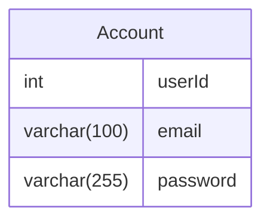
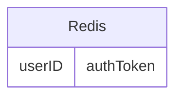
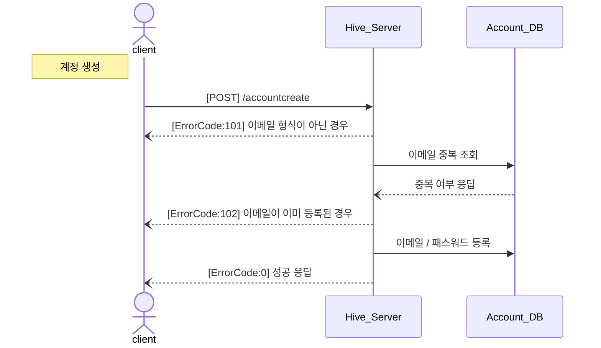
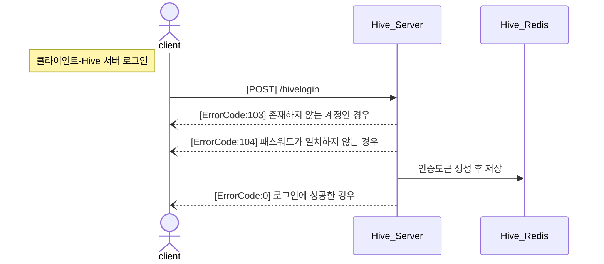
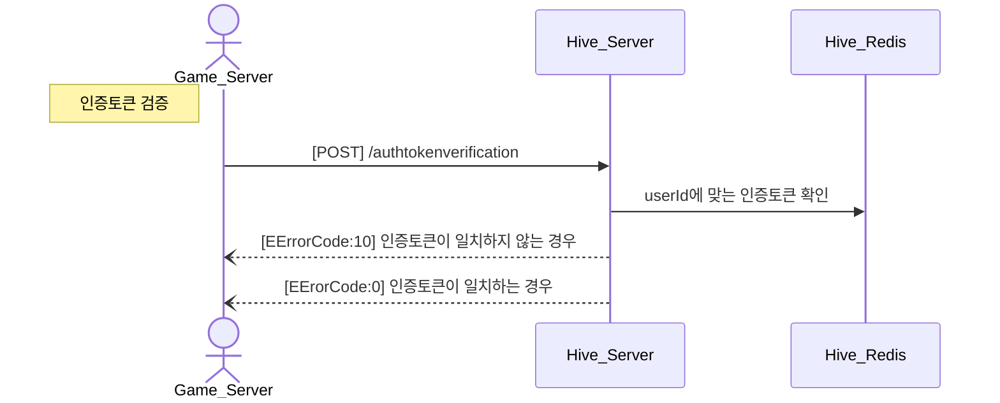
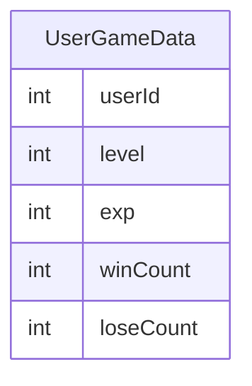
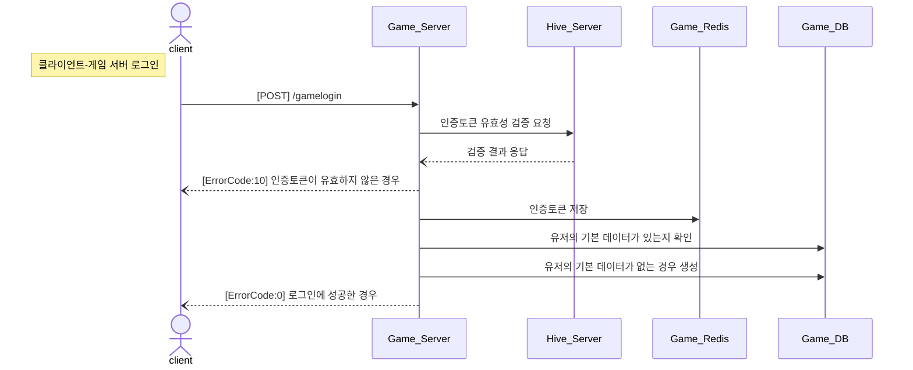

# OmokProj
김정아 컴투스 서버캠퍼스 2기
## API 서버

## Hive Server
### 계정 정보 테이블
<hr>


- 인덱스 : PRIMARY(PK인 userId에 대한 클러스터 인덱스), email(email을 컬럼으로 갖는 보조인덱스)
### Hive_Redis
<hr>



### 계정 생성
- 클라이언트 → 서버 전송 데이터
  - email : 이메일
  - password : 패스워드
1. email이 이메일 형식인지 확인
2. email가 accountDB에 이미 등록되어 있는지 확인
3. DB에 email과 password 등록(계정 생성)
- 요청 예시
  ```csharp
        POST http://localhost:5021/accountcreate
        Content-Type: application.json
        
        {
              "email" : "kong@gmail.com",
              "password" : "1234"
        }
  ```
  - 응답 예시
    - 이메일 형식이 아닌 경우(ErrorCode = 101(NotEmailForm))
      ```csharp
        {
              "result" : 101
        }
      ```
    - 이미 등록된 이메일인 경우(ErrorCode = 102(AlreadyExistAccount))
      ```csharp
        {
              "result" : 102
        }
      ```
    - 계정이 정상적으로 생성된 경우(ErrorCode = 0)
      ```csharp
        {
              "result" : 0
        }
      ```

<br>

### 계정 생성 Sequence Flow
***


<br>

### 클라이언트 - Hive 서버 로그인
- 클라이언트 → 서버 전송 데이터
  - email : 이메일
  - password : 패스워드
1. 이메일 형식이 맞는지 확인
2. email이 존재하는지 확인
3. accountDB에서 email에 해당하는 데이터 얻어오기
4. 전달받은 password와 얻어온 password가 일치하는지 확인
5. 인증토큰 생성
6. Redis에 인증토큰 저장
7. 인증토큰과 userID 응답

- 요청 예시
  ```csharp
        POST http://localhost:5021/hivelogin
        Content-Type: application.json
        
        {
              "email" : "kong@gmail.com",
              "password" : "1234"
        }
  ```
  - 응답 예시
    - 이메일 형식이 아닌 경우(ErrorCode = 101(NotEmailForm))
      ```csharp
        {
              "result" : 101
        }
      ```
    - 존재하지 않는 계정인 경우(ErrorCode = 111(NotExistAccount))
      ```csharp
        {
              "result" : 111
        }
      ```
    - 패스워드가 일치하지 않는 경우(ErrorCode = 112(WrongPassword))
      ```csharp
        {
              "result" : 112
        }
      ```
    - 로그인에 성공한 경우(ErrorCode = 0)
      ```csharp
        {
              "result" : 0,
              "userID" : 2,
              "authToken" : "ERQWEROJJP123"
        }
      ```

<br>

### 클라이언트 - Hive 서버 로그인 Sequence Flow
***


<br>

### 인증토큰 검증
- 게임 서버 → Hive 서버 전송 데이터
  - userID : 유저 id
  - authToken : 인증토큰
1. Hive 서버에 userID에 해당하는 인증토큰과 전달받은 인증토큰이 동일한지 확인
2. 게임 서버에 응답

- 요청 예시
  ```csharp
        POST http://localhost:5021/tokenverify
        Content-Type: application.json
        
        {
              "userID" : 3,
              "authToken" : "EQNKFLWE123"
        }
  ```
  - 응답 예시
    - 인증토큰이 일치하지 않는 경우(ErrorCode = 10(InvalidToken))
      ```csharp
        {
              "result" : 10
        }
      ```
    - 인증토큰이 없는 경우(ErrorCode = 11(TokenNotExist))
      ```csharp
        {
              "result" : 11
        }
      ```
    - 인증토큰이 일치하는 경우(ErrorCode = 0)
      ```csharp
        {
              "result" : 0
        }
      ```

<br>

### 인증토큰 검증 Sequence Flow
***

<br>

## Game Server
### 유저 정보 테이블
<hr>


- 인덱스 : PRIMARY(PK인 userId에 대한 클러스터 인덱스)
### Game_Redis
<hr>


### 클라이언트 - 게임 서버 로그인
- 클라이언트 → 서버 전송 데이터
  - userId : 유저 id
  - authToken : 인증토큰
1. 게임 서버가 Hive 서버에 인증토큰 유효성 검사 요청
2. 유효한 경우 게임 서버의 Redis에 저장
3. DB에 유저의 기본데이터가 존재하는지 확인
4. 없을 경우 기본데이터 생성
5. 로그인 성공 응답

- 요청 예시
  ```csharp
        POST http://localhost:5021/gamelogin
        Content-Type: application.json
        
        {
              "userID" : 3,
              "authToken" : "EIOQWENLFLQW123"
        }
  ```
  - 응답 예시
    - Hive 서버가 일치하지 않는다고 응답한 경우(ErrorCode = 10(InvalidToken))
      ```csharp
        {
              "result" : 10
        }
      ```
    - Hive 서버가 일치한다고 응답한 경우(ErrorCode = 0)
      ```csharp
        {
              "result" : 0
        }
      ```

<br>

### 클라이언트 - 게임 서버 로그인 Sequence Flow
***


<br>

