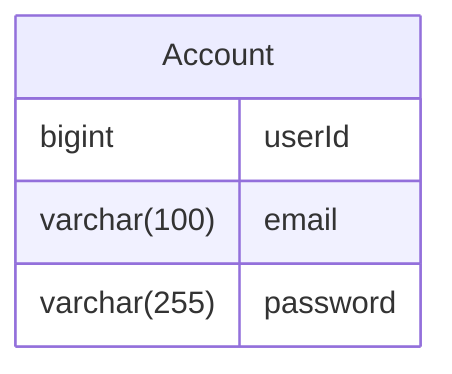
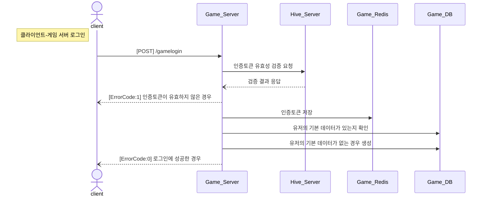

# OmokProj
## API 서버

## Hive Server
### 계정 정보 테이블
<hr>


- 인덱스 : PRIMARY(클러스터 인덱스), email(email을 컬럼으로 갖는 보조인덱스)
### 계정 생성
- 클라이언트 → 서버 전송 데이터
  - account : 이메일
  - password : 패스워드
1. account가 이메일 형식인지 확인
2. account가 accountDB에 이미 등록되어 있는지 확인
3. DB에 account와 password 등록(계정 생성)
- 요청 예시
  ```csharp
        POST http://localhost:5021/accountcreate
        Content-Type: application.json
        
        {
              "account" : "kong@gmail.com",
              "password" : "1234"
        }
  ```
  - 응답 예시
    - 이메일 형식이 아닌 경우(ErrorCode = 101(NotEmailForm))
      ```csharp
        {
              "result" : 101
        }
      ```
    - 이미 등록된 이메일인 경우(ErrorCode = 102(AlreadyExistAccount))
      ```csharp
        {
              "result" : 102
        }
      ```
    - 계정이 정상적으로 생성된 경우(ErrorCode = 0)
      ```csharp
        {
              "result" : 0
        }
      ```

<br>

### 계정 생성 Sequence Flow
***


<br>

### 클라이언트 - Hive 서버 로그인
- 클라이언트 → 서버 전송 데이터
  - account : 이메일
  - password : 패스워드
1. accountDB에서 account에 해당하는 데이터 얻어오기
2. account가 존재하는지 확인
3. 전달받은 password와 얻어온 password가 일치하는지 확인
4. 인증토큰 생성
5. Redis에 인증토큰 저장
6. 인증토큰 응답

- 요청 예시
  ```csharp
        POST http://localhost:5021/hivelogin
        Content-Type: application.json
        
        {
              "account" : "kong@gmail.com",
              "password" : "1234"
        }
  ```
  - 응답 예시
    - 존재하지 않는 계정인 경우(ErrorCode = 103(NotExistAccount))
      ```csharp
        {
              "result" : 103
        }
      ```
    - 패스워드가 일치하지 않는 경우(ErrorCode = 104(WrongPassword))
      ```csharp
        {
              "result" : 104
        }
      ```
    - 로그인에 성공한 경우(ErrorCode = 0)
      ```csharp
        {
              "result" : 0,
              "authToken" : "ERQWEROJJP123"
        }
      ```

<br>

### 클라이언트 - Hive 서버 로그인 Sequence Flow
***


<br>

### 인증토큰 검증
- 게임 서버 → Hive 서버 전송 데이터
  - account : 이메일
  - authToken : 인증토큰
1. Hive 서버에 account에 해당하는 인증토큰과 전달받은 인증토큰이 동일한지 확인
2. 게임 서버에 응답

- 요청 예시
  ```csharp
        POST http://localhost:5021/validauthtoken
        Content-Type: application.json
        
        {
              "account" : "kong@gmail.com",
              "authToken" : "EQNKFLWE123"
        }
  ```
  - 응답 예시
    - 인증토큰이 일치하지 않는 경우(ErrorCode = 1(InvalidToken))
      ```csharp
        {
              "result" : 1
        }
      ```
    - 인증토큰이 일치하는 경우(ErrorCode = 0)
      ```csharp
        {
              "result" : 0
        }
      ```

<br>

### 인증토큰 검증 Sequence Flow
***


<br>

## Game Server

### 클라이언트 - 게임 서버 로그인
- 클라이언트 → 서버 전송 데이터
  - account : 이메일
  - authToken : Hive 서버에게서 받은 인증토큰
1. Hive 서버에 인증토큰 유효성 검증 요청
2. 인증토큰이 유효하지 않은 경우 실패 응답
3. 유효한 경우 Redis에 해당 유저의 인증토큰 값 저장
4. 로그인 성공 응답

- 요청 예시
  ```csharp
        POST http://localhost:5021/gamelogin
        Content-Type: application.json
        
        {
              "account" : "kong@gmail.com",
              "authToken" : "EIOQWENLFLQW123"
        }
  ```
  - 응답 예시
    - Hive 서버가 일치하지 않는다고 응답한 경우(ErrorCode = 1(InvalidToken))
      ```csharp
        {
              "result" : 1
        }
      ```
    - Hive 서버가 일치한다고 응답한 경우(ErrorCode = 0)
      ```csharp
        {
              "result" : 0
        }
      ```

<br>

### 클라이언트 - 게임 서버 로그인 Sequence Flow
***


<br>

